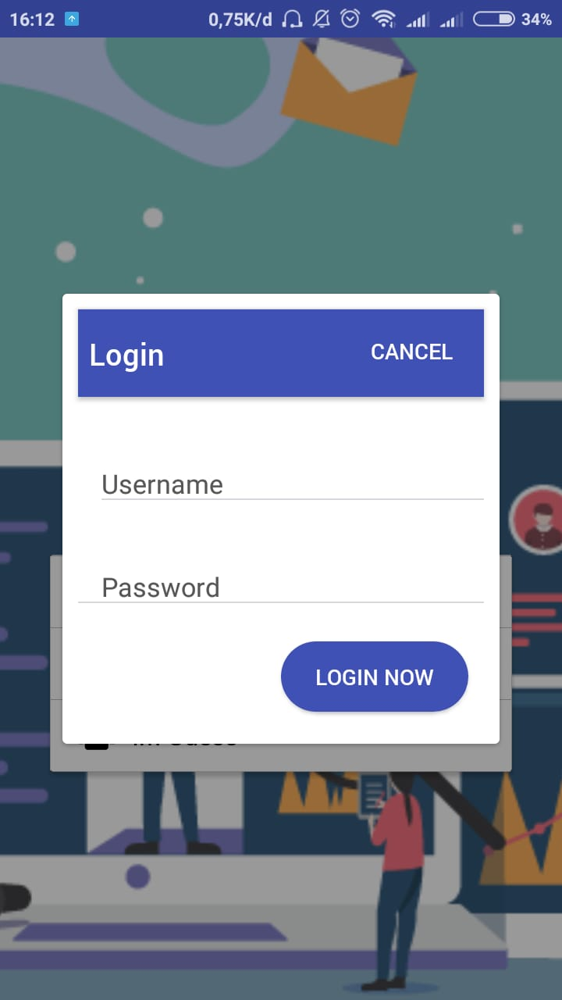
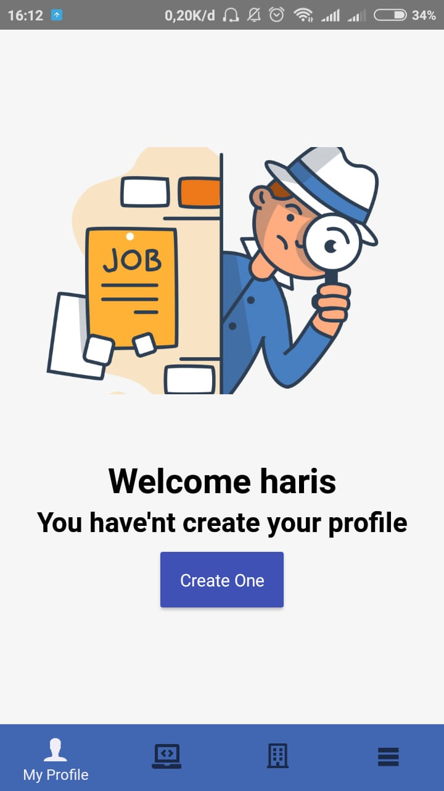
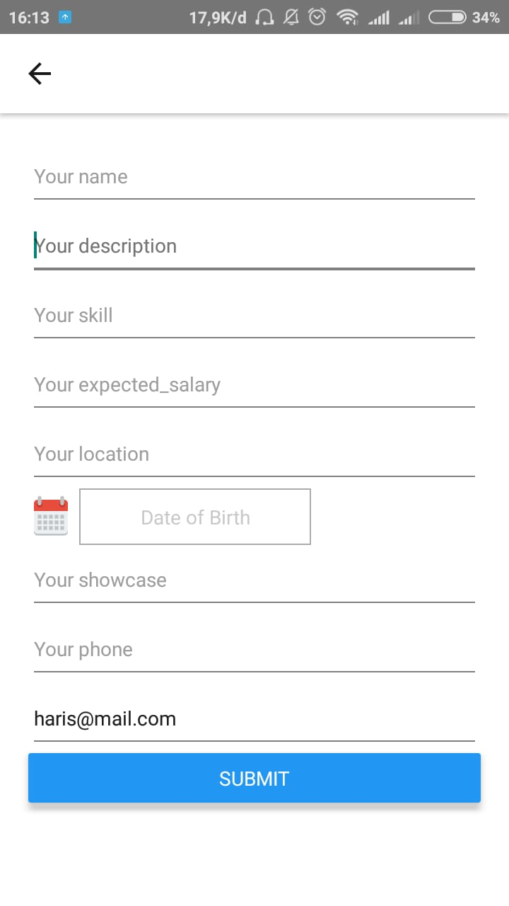
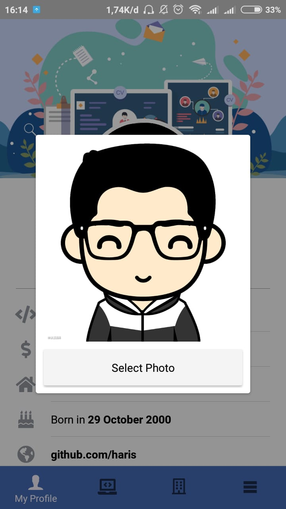
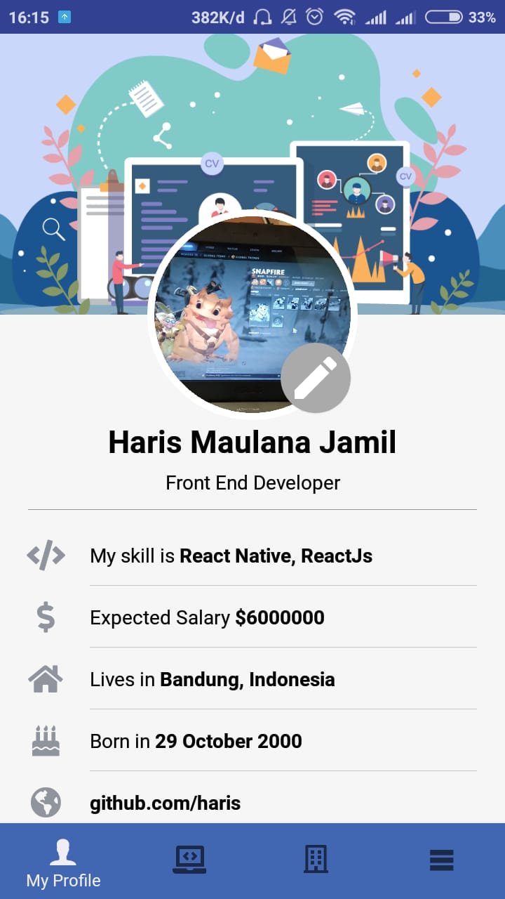
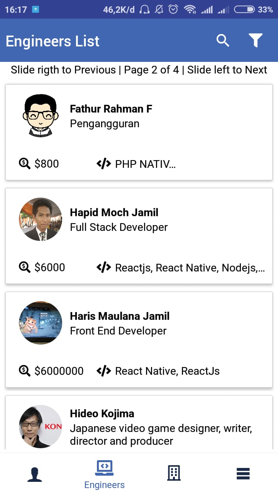
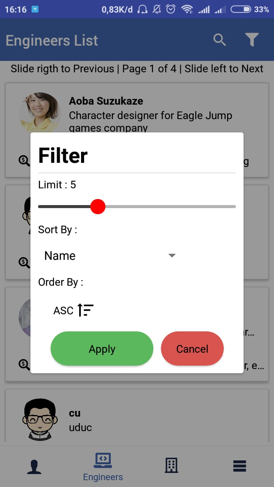
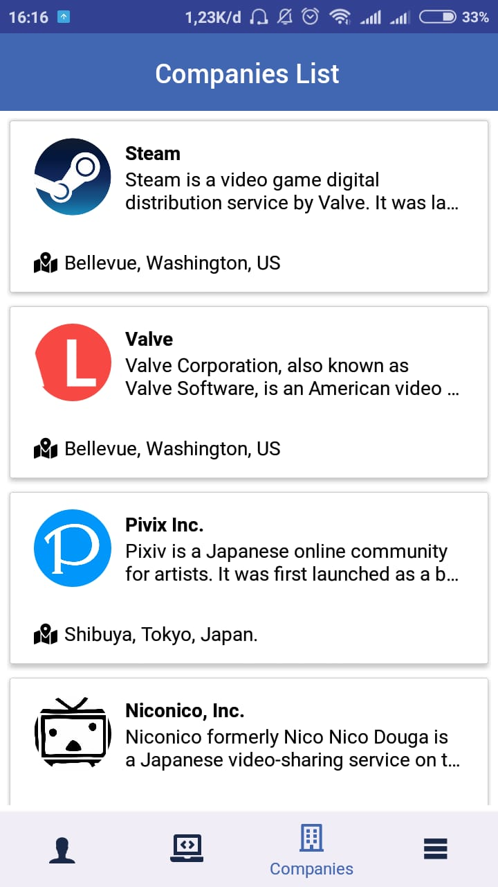
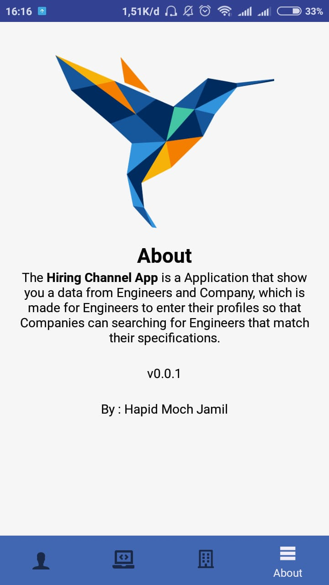

<h1 align="center">Hiring Channel App</h1>
  

    <image align="center" width="200" src='./screenshots/Component 1.png' />
  

  Built with React Native.

## Table of Contents

- [Introduction](#introduction)
- [Features](#features)
- [Requirements](#requirements)
- [Usage](#usage-for-development)
- [Screenshots](#screenshots)
- [Release APK](#release-apk)
- [Related Project](#related-project-backend)
- [Contributors](#contributors)

## Introduction
<b>Hiring Channel App</b> is a Android app that show you data from Company and Engineer, which is made for Engineers to enter their profiles so that Companies can searching for Engineers that match their specifications.

## Features
* User can create engineer or company account
* User can make a profile
* User can see another user profile
* And others

## Requirements
* [`nodejs`](https://nodejs.org/en/download/)
* [`react-native`](https://facebook.github.io/react-native/docs/getting-started)
* [`react-native-cli`](https://facebook.github.io/react-native/docs/getting-started)
* [`HiringChannelApp-ReactNative`](https://github.com/AdmiralYuuShi/HiringChannelApp-ReactNative.git)

## Usage for development
1. Open your terminal or command prompt
2. Type `git clone https://github.com/AdmiralYuuShi/HiringChannelApp-ReactNative.git`
3. Open the folder and type `npm install` for install dependencies
4. Type `react-native run-android` for run this app. ***Make sure your device is connected with debugging mode***.

## Screenshots

    
    
    
    
    
    
    
    
    
    
    
    

## Release APK

## Related Project
* [`Frontend-HiringChannelApp-WithRedux`](https://github.com/AdmiralYuuShi/Frontend-HiringChannelApp-WithRedux)
* [`Backend-HiringChannelApp`](https://github.com/AdmiralYuuShi/Backend-HiringChannelApp)

## Contributors

  <table>
    <tr>
      <td align="center">
        <a href="https://github.com/AdmiralYuuShi">
          <b>Hapid Moch Jamil (Admiral YuuShi)</b>
        </a>
      </td>
    </tr>
  </table>

